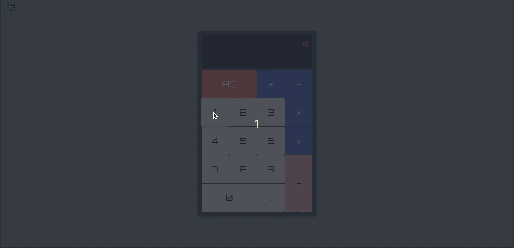

# Pocket Calculator

A small simple pocket calculator built by React.

    

## 1. Installation

This web application is not hosted anywhere so you will need to download the source as well as all dependencies in order to
compile and run it. Follow these steps to run and test the app:

1. Download the source code
2. Open the terminal, move into the folder containg the source code, then run the following command to install the dependencies:
   <code>~\$ npm install</code>
3. Run the following command to compile and run the app:
   <code>~\$ npm run start</code>

## 2. How to Use

Using the calculator is simple, just click on the numpad on the calculator and hit '=' when you want the result.
